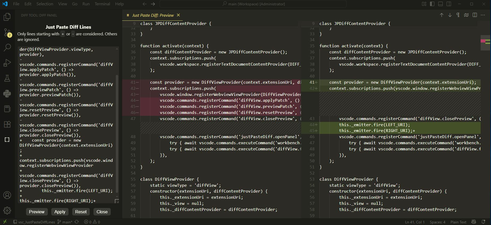

# Just Paste Diff Lines

🚀 **A minimal, no-frills diff tool for VS Code.**  
Paste only the lines starting with `+` or `-`, preview the result, and apply with a single click.  

This extension is designed to make testing small patches fast and frictionless – whether from code reviews, AI-generated suggestions, or forum posts.




---

## ✨ Features

- 📋 **Copy-paste friendly** – lines without a leading `+` or `-` are ignored, so you can paste raw snippets, forum posts, or AI outputs without cleanup.  
- 👀 **Preview before apply** – always see the exact changes side-by-side before committing them. Paste automatically activates preview. 
- 🔨 **Apply changes instantly** – patch the active file with one click. Apply buttton automatically cleans text area to make it ready for the next paste.
- ♻️ **Reset or close preview** – quickly discard or exit the diff view.  
- 🎯 **Super lightweight** – no `git apply`, no patch headers, no extra setup. No auto-save to stay in safe side. Manually save your file if everything is okay.
- 🔁 **Cursor reset (@@)** – include a line starting with @@ to reset the search cursor to the top of the file; the next change will be applied starting from the beginning.

---

## 🖼️ Example

1️⃣ Basic usage (normal diff):

Paste this into the diff panel:

```diff
-console.log("foo");
+console.log("bar");
```

To add new lines only, use the ‘Anchor Technique’: Start with (-) and (+) on the same existing line. 
All following (+) lines will then be pasted directly **UNDER** that chosen 'Anchor Line' in your code.
```diff
-self.log.pack(fill="both", expand=True, padx=6, pady=6)
+self.log.pack(fill="both", expand=True, padx=6, pady=6)
+    # Backend.verbose_logs control
+self.backend.log_fn = lambda s: self._log(self.log, s)
```

Then hit **Preview** → see the diff → **Apply** to patch your file.  

This is the basic usage: the lines starting with - are removed, and the lines starting with + are added/replaced.
Only lines starting with + or - are considered; other lines are ignored.


2️⃣ Optional usage (@@ for cursor reset):

```diff
@@
-console.log("foo");
+console.log("bar");
@@
-oldVar = 5;
+oldVar = 10;
```
Each @@ line resets the search, so the next - or + line is looked for from the start of the file again.
It is recommended to place @@ before each block for more reliability when applying multiple code blocks at once

---

## 🚀 How to Use

1. Copy any snippet that shows additions/removals.  
   - Example from a code review, StackOverflow answer, or an AI model (ChatGPT, Grok, Claude, etc.).  
   - Context lines or headers will be ignored unless they start with `+` or `-`.  
   - Optional: Use @@ to reset the cursor for the next change if needed.

2. Open the **Diff Tool** panel:  
   - Command Palette (`Ctrl+Shift+P`) → **Just Paste Diff: Open Panel**, or  
   - Click the **Diff Tool** icon in the Activity Bar.  

3. Paste the diff text.  
   - **Preview** → see side-by-side differences.  
   - **Apply** → update your active document.  

---

## 🤖 Using with AI Assistants (ChatGPT, Grok, Claude, Mistral, etc.)

Large language models (LLMs) often propose code changes . Instruct them to output simple diff-like changes using `-` and `+` prefixes.  
This extension makes it easy to apply them:  

- Instruct the model to output changes **only with `-` and `+` prefixes**, for example:

  ```diff
  -oldFunction();
  +newFunction();
  ```
- Optional: Use @@ to reset the cursor so the next change is applied from the start of the file.
- You can safely copy-paste the entire response; lines without `+` or `-` will be ignored automatically.  
- Always **Preview** first to confirm correctness before applying.  

To explain the correct way of using the extension to the AI assistant, you can provide it with the following instructions:  

```
"When suggesting code changes, use the diff approach: put a minus sign (-) at the beginning of old lines and a plus sign (+) at the beginning of new lines. Be careful to keep the exact number of spaces for alignment unchanged.  

If there are multiple changes, provide a separate diff block for each one. Do not insert extra blank lines, remove characters, or alter spacing, otherwise the changes cannot be applied automatically. If there are lines that remain unchanged within a block, you should include same line again with a plus sign (+) at the beginning — that will keep it unchanged. However, do not split the block or omit any lines inside the block.  

When adding a completely new block of code without deleting or modifying existing code, it is important to use the diff technique properly. To ensure the new block is inserted in the right place, select the line immediately above where it should go. In the diff, first write that line once with a minus sign (-) at the beginning, and then again same line with a plus sign (+). After that, you can safely add the new lines as plus sign (+) lines below it. This way, the diff will correctly insert the new block of code right under the chosen reference line.
```

---  


## ⚠️ Disclaimer

- This extension uses a **very simple line-based algorithm**.  
- It does not perform advanced context matching – lines are replaced, inserted, or deleted as-is.  
- **Always verify the preview** before applying.  
- Use at your own risk. (VS Code’s Undo is your friend.)  

---

## ⚙️ Commands

- **Just Paste Diff: Open Panel** → Open the diff panel.  
- **Just Paste Diff: Preview Patch** → Show a preview of changes.  
- **Just Paste Diff: Apply Patch** → Apply the patch to the active file.  
- **Just Paste Diff: Reset/Close Preview** → Reset or close the preview view.  

---

## 📦 Installation

- Marketplace: [Just Paste Diff Lines](https://marketplace.visualstudio.com/items?itemName=muvusoft.just-paste-diff-lines)  
- Manual: download the `.vsix` file and install via  
  **Extensions → … → Install from VSIX…**  

---

## 📄 License

MIT License. See [LICENSE](./LICENSE) for details.

---

🎯 With **Just Paste Diff Lines**, applying quick patches becomes as simple as copy, paste, preview, and apply. Perfect for lightweight workflows and AI-assisted coding.  
